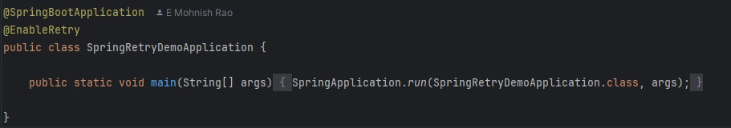
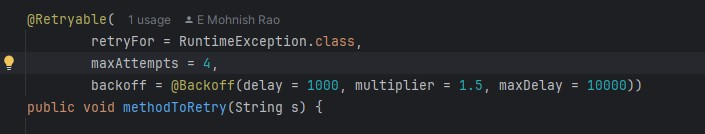
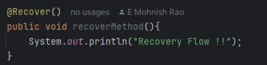
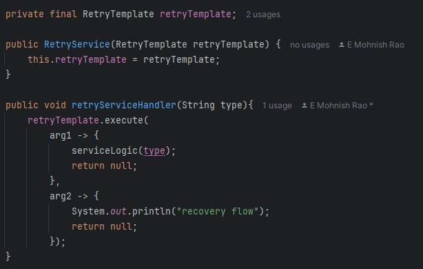

# Spring Retry :

Retrying in simple terms, is looping through a code snippet when any kind of error occurs.
Basically retry is implemented to handle transient errors gracefully (such as failed network calls or timeout error)  
Makes system more robust and stable

## Dependency for spring retry :

We require spring-retry as well as aspect (AOP) dependencies.

Gradle:
```
    implementation 'org.springframework.retry:spring-retry'
    implementation 'org.springframework:spring-aspects'
```

Maven:
```
    <dependency>
        <groupId>org.springframework.retry</groupId>
        <artifactId>spring-retry</artifactId>
    </dependency>
    <dependency>
        <groupId>org.springframework</groupId>
        <artifactId>spring-aspects</artifactId>
    </dependency>
```

## Using Retryable Annotation (Declarative way) :

Refer below class:
> java/com/example/spring_retry_demo/retryable/RetryableDemo.java

This approach is mostly annotation based, we need to annotate the main spring boot application class with @EnableRetry.



Now, In your service/business class, on the method where you want to implement the retry, annotate the method with
@Retryable and provide configuration for it.



We can provide for which exceptions (can also use custom exceptions) do we need to do the retry and the max attempts 
for the retry. 
Above is an example for exponential backoff, where delay will be increased by the multiplier after each iteration.

We can also provide normal timeout retry using config.
> backoff = @Backoff(delay = 1000)

Note* max attempts is including the normal flow i.e. if maxAttempts = 4, then
1 x Normal Flow and 3 x Retry Flow

Now to handle recovery flow, create a method that will handle the error when max attempts runs out.
Annotate teh method with @Recover.



### Test
Hit API : GET - http://localhost:8080/retryable/exception

## Using Retry template (Imperative way)
Refer below class:
> java/com/example/spring_retry_demo/retry_interface/RetryTemplateConfig.java

In this way we need to create a config bean for Retry Template, wherein we set retry policy and backoff policy.

### Retry policy :

Retry policy is used in Retry Template, to basically tell the template how many times and for which exception 
we need to retry. 

Even though it is not very harmful to retry again and again for the same exception, it is not advisable to do so,
as it can waste the resources, moreover it makes no sense if that exception has the behaviour for occurring 
continuously. So only retry for the exceptions which are valid for our use case and might heal over some period of time.
```
    SimpleRetryPolicy simpleRetryPolicy = 
        new SimpleRetryPolicy(3, Collections.singletonMap(RuntimeException.class, true));
        
    // 1st arg = max attempts
    // 2nd arg = Exceptions for which we have to retry
```
OR
```
    TimeoutRetryPolicy timeoutRetryPolicy = new TimeoutRetryPolicy();
    timeoutRetryPolicy.setTimeout(5000);
```

### Back-Off policy :

Backoff provides more functionality than a simple timeout, we can have random backoff, exponential back off etc.

- Fixed backoff policy : As name suggest, we can provide a backoff period.

```
    FixedBackOffPolicy fixedBackOffPolicy = new FixedBackOffPolicy();
    fixedBackOffPolicy.setBackOffPeriod(5000);
```

- Uniform random backoff policy : Here we can provide a min and max backoff period, and each iteration 
 of retry will occur at a random period between these timeout values.

```
    UniformRandomBackOffPolicy backOffPolicy = new UniformRandomBackOffPolicy();
    backOffPolicy.setMinBackOffPeriod(5001);
    backOffPolicy.setMaxBackOffPeriod(10001);
```

- Exponential backoff policy : Here we provide an initial backoff period, and after each iteration
  of retry will occur at a period which is multiplier of the initial value. 
  And this goes on till the max interval is reached, then all timeout will be equal to the max interval
  - Example : In below case, the initial timeout is 3sec and multiplier is 1.5, 
    so the next timeout period will be 1.5 times 3 secs i.e. 4.5secs and next will be 1.5 times 4.5 secs as so on.

```
    ExponentialBackOffPolicy exponentialBackOffPolicy = new ExponentialBackOffPolicy();
    exponentialBackOffPolicy.setInitialInterval(3000);
    exponentialBackOffPolicy.setMultiplier(1.5);
    exponentialBackOffPolicy.setMaxInterval(10000);
```

### Creating Retry Template

Now we can set the retry policy and backoff policy in retryTemplate.

```
    RetryTemplate retryTemplate = new RetryTemplate(); 
    retryTemplate.setRetryPolicy(simpleRetryPolicy); // set retry policy here
    retryTemplate.setBackOffPolicy(backOffPolicy); // set backoff policy
    return retryTemplate;
```

Another way for building retry template is to use the retry template builder.
```
    retrun RetryTemplate.builder()
                .maxAttempts(4)
                .withTimeout(Duration.ofSeconds(5))
                .retryOn(RuntimeException.class)
                .notRetryOn(List.of(IllegalAccessException.class, IllegalStateException.class))
                .traversingCauses()
                .build();
```

### Using the template

Refer class: 
> com/example/spring_retry_demo/retry_interface/RetryService.java

Now we can use the retry template bean to execute our main code that is to be retried upon.

Here retryTemplate.execute() will take 2 callbacks, RetryCallback and RecoverCallback.
arg1 and arg2 are the Retry Contexts, it will contain the information on the current retry like getRetryCount, 
getLastThrowable etc.  



> retryTemplate.execute(Method_to_retry, Recovery_Method)

### Test
Hit API : GET - http://localhost:8080/retrytemplate/exception